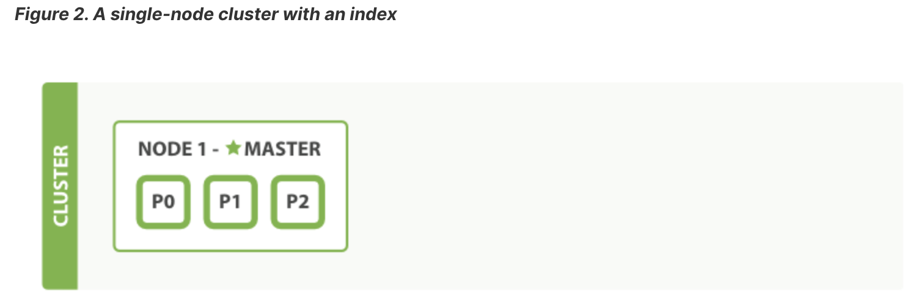
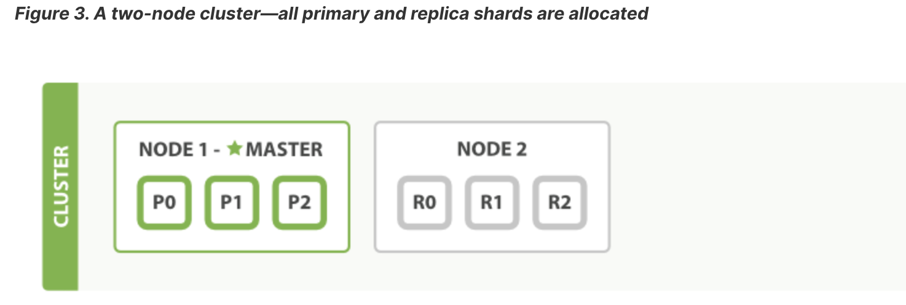
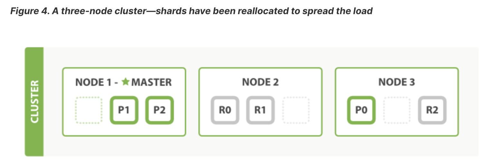

# Elasticsearch

## Основные тезисы

Доки в elasticsearch хранятся в JSON формате в индексе.

Индекс - логическое место хранения доков.

Физически индекс - это группа шардов, разбитых по нодам кластера

Каждый шард хранит какое-то подмножество документов и управляется поисковым
движком [apache lucene](https://lucene.apache.org/)

При создании индекса можно указать, сколько шардов будет в индексе:

```json
{
  "settings": {
    "number_of_shards": 3,
    "number_of_replicas": 1
  }
}
```

Кол-во шардов нельзя изменять после создания индекса, но можно изменять количество реплик

Указывая количество реплик, мы указываем количество реплик для каждого шарда: выше мы указали, что индекс будет состоять
из двух `primary` шардов, и для каждого `primary` шарда будет 1 реплика

Нет смысла хранить реплику на той же ноде кластера, что и `primary` шард, поэтому если при вышеуказанной конфигурации мы
запустим кластер с одной нодой, то на этой ноде будут только 3 `primary` шарда:


При добавлении второй ноды, на ней будут запущены реплики:


При последующем добавлении нод в кластер шарды - `primary` и реплики - будут перераспределяться по нодам для повышения
отказоустойчивости


При текущей конфигурации в кластер имеет смысл добавить 6 нод - 3 ноды на каждый `primary` шард и 3 ноды на каждую
реплику.

Повышать кол-во `primary` шардов нельзя. То есть горизонтально масштабировать ресурсы для хранения больше, чем на 3 ноды
не получится. Однако, увеличив кол-во реплик возможно повысить производительность поиска, так как elasticsearch
распаралелливает поисковой запрос по репликам

---
Индекс имеет плоскую структуру - то есть определять явные связи между документами, как в реляционных БД не получится

- Связывать доки можно по айдишникам, например хранить различные доки `Order(orderId, userId)`, `User(userId)` и логику
  связывания
  переложить на плечи приложения
- Либо хранить связь в виде вложенных документов: `OrderId(orderId, user = User(userId))`

Операции над документом в индексе транзакционные.

Транзакционное обновление над несколькими доками не поддерживаются

Документ - это JSON строка - состоит из полей и значений.

Поля в документе можно глобально разделить на два типа:

- точные значения (exact values): используются для фильтрации и уменьшения количества результатов, к которым будет
  применен анализ и скоринг для полнотекстового поиска
- текст (full text): используются для полнотекстового поиска

Для поиска elasticsearch поддерживает inverted index используя apache lucene.

Допустим у нас есть два документа с полем `content`:

- "The quick brown fox jumped over the lazy dog"
- "Quick brown foxes leap over lazy dogs in summer"

Грубо говоря:

- мы разделяем `content` каждого документа на отдельные слова (которые называем term-ы или token-ы),
- сортируем токены
- создаем отображения токена на список документов, где он встречается:

```
Term      Doc_1  Doc_2
-------------------------
Quick   |       |  X
The     |   X   |
brown   |   X   |  X
dog     |   X   |
dogs    |       |  X
fox     |   X   |
foxes   |       |  X
in      |       |  X
jumped  |   X   |
lazy    |   X   |  X
leap    |       |  X
over    |   X   |  X
quick   |   X   |
summer  |       |  X
the     |   X   |
------------------------
```

На самом деле elastcsearch не просто разделяет значения полей на слова и запихивает их в индекс.
Сначала значения полей документа анализируются.

Анализ производится `анализатором (analyzer)`, который состоит из токенизатора `tokenizer` и нули или более
фильтров `filters`

`Tokenizer` используется, чтобы разбить текст на токены.

Токены - состоят из термов `term`

`Term` - это единица поиска текста. Именно термы являются ключами в `inverted index`

Помимо термов токены содержат информацию о позициях термов и их длине

Результатом работы `tokenizer`-а является стрим (stream) токенов

Каждый токен из стрима обрабатывается цепочкой фильтров, например:

- `Lowercase Filter`
- `Synonims Filter`: заменяет один токен на другой на базе правил синонимов (synonym rules)
- `Language stemming filter`: приводит токены к корневой форме, которая
  называется `stem` (`jumping`, `jumped` -> `jump`)

Elasticsearch (и Opensearch) поддерживают
несколько [встроенных анализаторов](https://opensearch.org/docs/latest/analyzers/index/#built-in-analyzers), а
также [множество фильтров](https://opensearch.org/docs/latest/analyzers/token-filters/index/)

Когда в elasticsearch приходит поисковой запрос, сам запрос проходит ту же процедуру анализа, что и проиндексированный
текст, и далее по полученным термам из запроса происходит поиск документов в `inverted index`-е

## Поиск в маркетплейсе

Рассмотрим поиск в elasticsearch на примере маркетплейса.

Что хотят пользователи маркетплейса:

### Функциональные требования для поиска

- Получать ленту товаров на основе выбранной категории
- Искать товары с помощью поисковой строки
- Скроллить ленту с результатами
- Применять фильтры различные фильтры согласно выбранной категории
- Получать as-you-type suggestions
    - Для автокомплита по префиксу введенного текста прямо в поисковой строке.  
      Например, набрав: "декоративная ва" пользователь может желать получить подсказки:
        - "декоративная ваза"  
          Нажав: `tab` заавтокомплитить слово "ваза", и получить следующую подсказку:
        - "декоративная ваза под сухоцветы"
    - Для подсказок в выпадающем списке под поисковой строкой (не только по префиксу)  
      Например, набрав: "декоративная ваза" может жедать получить подсказки
        - "декоративная ваза под сухоцветы"
        - "ваза декоративная керамическая"
        - ...

- Сортрировать результаты:
    - по рейтингу
    - по стоимости
    - по популярности
    - по времени доставки (зависит от расстояния от места положения покупателя до точки, с которой продавец отправляет
      товар)

Чего пользователи точно не хотят:

- Набрав в поиске "декоративная ваза" они не хотят получить в результате "декоративный горшок"  
  Существительное "ваза" тут играет первостепенную роль. Если ваз на маркетплейсе не нашлось, то другие "декоративные"
  вещи выдавать в качестве результат не нужно.

### Модель данных

Для начала нужно [создать индекс](https://www.elastic.co/guide/en/elasticsearch/guide/master/_creating_an_index.html)

По умолчанию, индекс автоматически создается при попытке добавить туда документ.

Отключить это можно настройкой: `action.auto_create_index: false`

Подробнее о том, как конфигурить
кластер [здесь](https://opensearch.org/docs/2.11/install-and-configure/configuring-opensearch/index/)

Для создания индекса в запросе нужно указать его настройки: `settings` и маппинг полей `mappings`

```http request
PUT /my_index
Content-Type: application/json

{
    "settings": { ... any settings ... },
    "mappings": {
        "type_one": { ... any mappings ... },
        "type_two": { ... any mappings ... },
        ...
    }
}
```

В настройках можно указать, например:

- кол-во шардов в индексе (5 по дефолту)
- кол-во реплик
- ...

Маппинг включает в себя в том числе типы данных полей документа.
Там можно указать еще другие настройки полей, например, каким анализатором будет анализироваться поле, и другие.
Но пока что остановится на типах данных.

Индекс будет содержать информацию о продуктах, поэтому будет называться `products`

Исходя из [функциональных требовний](#функциональные-требования-для-поиска), продукт будет содержать:

- id
- называние
- описание
- категорию
- цену
- геолокацию
- пользовательский рейтинг
- популярность (для нашего примера просто какое-то число от 0 до 1)

Opensearch поддерживает различные типы данных.
Более подробно о типах данных [можно почитать в документации](https://opensearch.org/docs/latest/field-types/index/)

Сейчас постараемся упростить себе задачу, и рассмотрим только самые базовые типы, необходимые для того, чтоб реализовать
базовый поиск.
Идентификатор хранится в метаданных документа, и не объявляется в маппинге.

Для текстовых полей `opensearch` поддерживает:

- `text`: строка, которая проходит через анализатор и разбивается на токены - подходит для полнотекстового поиска
- `keyword`: строка, которая не анализируется, не разделяется на термы, в `inverted index` она входит целиком - подходит
  для фильтрации

Для чисел ([Numeric](https://opensearch.org/docs/latest/field-types/supported-field-types/numeric/)):

- integer
- long
- float
- double
- ...

Для
геологации ([Geographic field types](https://opensearch.org/docs/latest/field-types/supported-field-types/geographic/))

- geo_point
- ...

Используем их для типов полей продукта:

```json
{
  "settings": {
    "number_of_shards": 3,
    "number_of_replicas": 1
  },
  "mappings": {
    "properties": {
      "name": {
        "type": "text"
      },
      "description": {
        "type": "text"
      },
      "category": {
        "type": "keyword"
      },
      "price": {
        "type": "double"
      },
      "rating": {
        "type": "double"
      },
      "popularity": {
        "type": "double"
      },
      "location": {
        "type": "geo_point"
      }
    }
  }
}
```

Можно запустить opensearch кластер в [docker-compose](./docker/docker-compose.yaml) и выполнить запрос:

```http request
PUT http://localhost:9200/products
Content-Type: application/json

{
  "settings": {
    "number_of_shards": 1,
    "number_of_replicas": 3
  },
  "mappings": {
    "properties": {
      "name": {
        "type": "text"
      },
      "description": {
        "type": "text"
      },
      "category": {
        "type": "keyword"
      },
      "price": {
        "type": "double"
      },
      "rating": {
        "type": "double"
      },
      "popularity": {
        "type": "double"
      },
      "location": {
        "type": "geo_point"
      }
    }
  }
}
```

В проекте будем использовать [spring-data-opensearch](https://github.com/opensearch-project/spring-data-opensearch) на
базе [spring data elasticsearch](https://docs.spring.io/spring-data/elasticsearch/reference/index.html)

Для отправки запросов в opensearch будем пользоваться `OpenSearchRestTemplate`. Конфигурацию можно посмотреть
в [RestClientConfig.java](./src/main/java/ru/max/demo/elastic/RestClientConfig.java)

Метод создания индекса находится
в [OpenSearchRestController](./src/main/java/ru/max/demo/elastic/OpenSearchRestController.java)

### Тестовые данные

Чтобы начать искать, организуем тестовые данные.

У нас будут продукты из трех категорий:

- одежда
- декор для дома
- посуда

Тестовые данные размещены в файле [resources/test-data.json](./src/main/resources/test-data.json)

В [OpenSearchRestController](./src/main/java/ru/max/demo/elastic/OpenSearchRestController.java) есть
метод `POST /create-test-data`, который вычитывает этот файл и вставляет данные в индекс `products`

### Поиск. Фильтрация

Теперь можно приступать к поиску.

Начнем с первого требования:

- пользователи хотят получать ленту продуктов по выбранной категории

Когда пользователь выбирает категорию "декор для дома", он ожидает увидеть вещи именно из этой категории. Его не
интересуют вещи из категории "декор для сада", например. То есть нам **нужно полное соответствие.**

Поисковые запросы в elasticsearch (opensearch) могут выполняться
в [двух контекстах](https://opensearch.org/docs/2.11/query-dsl/query-filter-context):

- `filter context`: в этом контексте запрос спрашивает "подходит ли доукмент под этот запрос или нет" и возвращает
  подходящие документы без вычисления релевантности.
- `query context`: в этом контексте запрос спрашивает "насколько документ подходит под запрос" и возвращает документы
  отсортированные по релевантности

При фильтрации не выполняется анализ запроса, разбиение его на термы, подсчет релевантности и сортировка результатов.
И запросы (`queries`)
в `filter context` [кэшируются](https://www.elastic.co/guide/en/elasticsearch/guide/master/filter-caching.html) и потом
могут быть переиспользованы другими поисковыми запросами (`search requests`)
Поэтому фильтрация происходит намного быстрее, чем поиск.
И поэтому фильтровать имеет смысл только по `exact value` полям.

`The goal of filtering is to reduce the number of documents that have to be examined by the scoring queries.`

Мы сделали поле `category` как раз `exact value` полем - с типом `keyword`

Для точного совпадения используется т.н. [term запрос](https://opensearch.org/docs/latest/query-dsl/term/term/).

Чтобы запустить этот запрос в `filter context` нужно использовать `filter clause`. Но его мы можем использовать только
в [compound queries](https://opensearch.org/docs/2.11/query-dsl/compound/index/). Например `constant_score`, который
просто присваивает результатам поиска одинаковое значение релевантности

`GET http://localhost:9200/products/_search`

```json
{
  "query": {
    "constant_score": {
      "filter": {
        "term": {
          "category": "декор для дома"
        }
      }
    }
  }
}
```

Разберемся со структурой.

Все поисковые запросы (В том числе на фильтрацию) имеют следующий формат:

```json
{
  "query": "YOUR_QUERY_HERE"
}
```

Например:

1) Для поиска всех документов в индексе используется запрос `match_all: {}`:

```json
{
  "query": {
    "match_all": {}
  }
}
```

2) Для простого полнотекстового поиска по конкретному полю - `match`:

```json
{
  "query": {
    "match": {
      // name - это название поля в документе
      "name": "плед"
    }
  }
}
```

3) А для фильтрации по `exact value` полю - `term` в `filter` контексте (`filter` clause) (обернутый
   в [compound запрос](https://opensearch.org/docs/2.11/query-dsl/compound/index/)). Например, как было указано выше:

```json
{
  "query": {
    "constant_score": {
      "filter": {
        "term": {
          "category": "декор для дома"
        }
      }
    }
  }
}
```

Или:

```json
{
  "query": {
    "bool": {
      "filter": {
        "term": {
          "category": "декор для дома"
        }
      }
    }
  }
}
```

4)

Вот [список базовых запросов](https://www.elastic.co/guide/en/elasticsearch/guide/master/_most_important_queries.html)

И так, запрос  
`GET http://localhost:9200/products/_search`

```json
{
  "query": {
    "constant_score": {
      "filter": {
        "term": {
          "category": "декор для дома"
        }
      }
    }
  }
}
```

отдает продукты из категории "декор для дома".

Эти результаты будут отображаться в ленте на UI, поэтому нужна возможность скролить результаты

Наиболее оптимальный способ -
использовать [Point in time search](https://opensearch.org/docs/latest/search-plugins/point-in-time/)

При этом подходе создается PIT (point in time) - фактически snapshot индекса на определенный промежуток времени,
задаваемый при его создании:

`POST /products/_search/point_in_time?keep_alive=10m`

В результате возвращается PIT ID, который используется при отправке запросов на поиск. При этом нужно использовать
сортировку по какому-то полю по умолчанию, чтобы иметь возможность запрашивать следующую пачку результатов. В нашем
случае сортировка по умолчанию будет по популярности товара:

```json
{
  "size": 4,
  "track_total_hits": false,
  "query": {
    "constant_score": {
      "filter": {
        "term": {
          "category": "декор для дома"
        }
      }
    }
  },
  "pit": {
    "id": "the_pit_id",
    "keep_alive": "10m"
  },
  "sort": [
    {
      "popularity": "desc"
    }
  ]
}
```

Мы установили `track_total_hist: false` для увеличения производительности и уменьшения затрат ресурсов во время
выполнения запроса, так как если оставить его по дефолту `true`, то opensearch должен будет с каждого шарда запросить
все документы, которые подходят под критерий, чтобы посчитать их кол-во. Если же установить в `false`, он запросит
только максимум `size` результатов.

В результате вернулся список результатов, в котором последний имел значение:

```json
{
  "_index": "products",
  "_id": "DoeB8YsBl3JKYKoOAx4P",
  "_score": null,
  "_source": {
    "_class": "ru.max.demo.elastic.model.Product",
    "category": "декор для дома",
    "name": "Шерстяной плед серого цвета",
    "description": "Теплый и мягкий шерстяной плед серого цвета. Идеален для создания уюта в холодные вечера.",
    "price": 3200.0,
    "rating": 4.6,
    "popularity": 0.85,
    "location": {
      "lat": 55.7558,
      "lon": 37.6173
    }
  },
  "sort": [
    0.85
  ]
}
```

В нем параметр `sort` имеет значение `0.85`.
Это значение мы будем использовать для получения следующей страницы.

Чтобы получить следующую страницу, нужно
указать [search_after](https://opensearch.org/docs/latest/search-plugins/searching-data/paginate/#the-search_after-parameter)
параметр. Он используется и сам по себе, но нам важно, что его можно
использовать [вместе с PIT поиском](https://opensearch.org/docs/latest/search-plugins/point-in-time/#pagination-with-pit-and-search_after)

```json
{
  "size": 3,
  "track_total_hits": false,
  "query": {
    "constant_score": {
      "filter": {
        "term": {
          "category": "декор для дома"
        }
      }
    }
  },
  "pit": {
    "id": "the_pit_id",
    "keep_alive": "10m"
  },
  "sort": [
    {
      "popularity": "desc"
    }
  ],
  "search_after": [
    0.85
  ]
}
```

И так пока не вернется пустая страница.

Я добавил ручку `/index/filter/{index}`
в [OpenSearchRestController](./src/main/java/ru/max/demo/elastic/OpenSearchRestController.java)
для фильтрации с возможностью скролить результат через PIT запрос.

На данном этапе мы реализовали следующие из требований:

- Получать ленту товаров на основе выбранной категории
- Скроллить ленту с результатами
- Применять фильтры различные фильтры согласно выбранной категории

- Сортрировать результаты:
    - по рейтингу
    - по стоимости
    - по популярности

Теперь разберемся с поиском

### Полнотекстовый поиск

Требования:

- Искать товары с помощью поисковой строки
- Пользователи хотят получать релевантные результаты даже при наличии опечаток
- Скроллить ленту с результатами
- Получать as-you-type suggestions
    - Для автокомплита по префиксу введенного текста прямо в поисковой строке.  
      Например, набрав: "декоративная ва" пользователь может желать получить подсказки:
        - "декоративная ваза"  
          Нажав: `tab` заавтокомплитить слово "ваза", и получить следующую подсказку:
        - "декоративная ваза под сухоцветы"
    - Для подсказок в выпадающем списке под поисковой строкой (не только по префиксу)  
      Например, набрав: "декоративная ваза" может жедать получить подсказки
        - "декоративная ваза под сухоцветы"
        - "ваза декоративная керамическая"
        - ...

Пойдем по порядку.

#### Искать товары с помощью поисковой строки

Полнотекстовые запросы выполняются
в [query_context](https://opensearch.org/docs/latest/query-dsl/query-filter-context/#query-context)

Два важных аспекта полнотекстовых запросов:

- **релевантность**: возможность ранжировать результаты по тому, насколько они релевантны данному запросу
- **анализ*

Все запросы вычисляют релевантность, но не все запросы имеют фазу анализа

#### term-based queries

Запросы типа `term` и `fuzzy` - низкоуровневые запросы и не имеют фазы анализа. Они оперируют единичными термами.
`term` запрос для строки `Foo` в поле `type` документа ищет точное совпадение в `inverted index`-е и вычисляет
релевантность -
поле (`_score`), которое будет отображаться в результате поиска для каждого найденного документа.

Важно помнить, что ищется точное совпадение. Документы, где поле `type` имеет значение `foo` или `FOO` не подойдут под
запрос.

#### full-text queries

Запросы типа `match` - высокоуровневые запросы и основаны на типе поля, по которому происходит поиск.

- Поиск по `date` или `integer` (или другому числовому типу) будет обрабатывать строку запроса как дату или число
  соответственно.
- Поиск по `exact value` полю (или иначе `not analyzed` полю), например с типом `keyword` будет обрабатывать строку
  запроса как
  единый цельный `term`
- Поиск по `analyzed` полю, например с типом `text`, сначала пропустит строку поиска через анализатор, который разобьет
  ее на термы, и затем поиск в `inverted index`-е будет происходить по всем полученным в результате `term`-ам.

И так, нам нужно выдавать результаты через строку поиска.
Самый простой способ в лоб - использовать `match` запрос.
Полезно прочесть следующие разделы:

- [the match query](https://www.elastic.co/guide/en/elasticsearch/guide/master/match-query.html)
- [multiword query](https://www.elastic.co/guide/en/elasticsearch/guide/master/match-multi-word.html)

Попробуем найти все декоративные вазы:

`GET http://localhost:9200/products/_search`

```json
{
  "query": {
    "match": {
      "name": "декоративная ваза"
    }
  }
}
```

В результате мы получим:

```json
[
  {
    "_source": {
      "name": "ваза декоративная керамическая черная"
    }
  },
  {
    "_source": {
      "name": "ваза декоративная керамическая белая"
    }
  },
  {
    "_source": {
      "name": "Стеклянная ваза черная"
    }
  },
  {
    "_source": {
      "name": "Декоративная лампа на трех ножках"
    }
  },
  {
    "_source": {
      "name": "ваза керамическая синяя"
    }
  },
  {
    "_source": {
      "name": "ваза стеклянная прозрачная"
    }
  },
  {
    "_source": {
      "name": "Керамическая ваза коричневого цвета"
    }
  }
]
```

То есть помимо декоративных ваз мы получили, например, декоративную лампу. Что никак не относится к вазам.

Дело в том, как работает `match` по умолчанию:

- анализатор разбивает запрос на термы:
    - term: декоративная
    - term: ваза
- для каждого терма создает отдельный `term` запрос
-

эти `term` [запросы объединяются в `bool` запрос](https://www.elastic.co/guide/en/elasticsearch/guide/master/_how_match_uses_bool.html)

```json
{
  "query": {
    "bool": {
      "should": [
        {
          "term": {
            "name": "декоративная"
          }
        },
        {
          "term": {
            "name": "ваза"
          }
        }
      ]
    }
  }
}
```

Как итог, в результат попадут документы, которые содержат **хотя бы один** `term`.
Документы, которые содержат оба `term`-а будут выше в результате (их `_score` будет больше).
Но результат может содержать длинный хвост нерелевантных документов.

Это можно исправить, если в результат будут попадать только те доки, которые содержат все термы.
`match` запрос принимает параметр `operator`, по умолчанию равный `or`:

```json
{
  "query": {
    "match": {
      "name": {
        "query": "декоративная ваза",
        "operator": "and"
      }
    }
  }
}
```

Тогда в результирующем `bool` запросе вместо `should` будет `must` clause.

```json
{
  "query": {
    "bool": {
      "must": [
        {
          "term": {
            "name": "декоративная"
          }
        },
        {
          "term": {
            "name": "ваза"
          }
        }
      ]
    }
  }
}
```

Варинты, когда либо нужны все термы, либо хотя бы один терм, чтобы документ подошел - это две крайности.
Хочется что-то среднее.

`matсh` запрос принимает параметр `minimum_should_match`, который может принимает значения либо в единицах, либо в
процентах.
Он определяет количество термов, которые должен содержать документ, чтобы подойти под запрос.

```json
{
  "query": {
    "match": {
      "name": {
        "query": "декоративная ваза",
        "minimum_should_match": "70%"
      }
    }
  }
}
```

Самое важное, что стоит вынести из работы полнотекстовых запросов - это то, что:

- поисковая строка разбивается на термы
- для каждого терма составляется низкоуровневый запрос - в данном случае выше это `term` запрос
- эти низкоуровневые запросы объединяются в `compound` запрос

Примерно так в итоге будут работать почти все полнотекстовые запросы.
В нашем распоряжении только `inverted index`.
Искать мы можем только в нем.
`inverted index` - это по сути мапа `term` -> список доков.

Поэтому принцип работы всех полнотекстовых запросов будет примерно одинаковый.

Все, чем остальные поисковые запросы друг от друга отличаются, это:

- какие анализаторы они используют и на какие термы разбивается поисковая строка
- какие низкоуровневые запросы используются для поиска термов
- в какой `compound` запрос эти низкоуровневые запросы объединяются
- как вычисляется релевантность (_score)

Ну и в запросы можно передавать различные параметры для контроля соотношения `precision` - `recall`.

Более подробно про комбинирование запросов
можно [почитать здесь](https://www.elastic.co/guide/en/elasticsearch/guide/master/bool-query.html).

Сейчас есть несколько проблем с запросом:

```json
{
  "query": {
    "match": {
      "name": {
        "query": "ваза синяя",
        "operator": "and"
      }
    }
  }
}
```

Основные проблемы можно выделить следующие:

- **он не поддерживает формы слов**: если ввести "ваза синего цвета", то документ "ваза керамическая синяя" не появится
  в результате
- **он не поддерживает синонимы**: если ввести "ваза голубая", то документ с названием "ваза керамическая синяя" не
  появится
  в результате
- **он не поддерживает связь между словами**: в том смысле, что слово "синяя" относится к слову "ваза". Однако если
  будет документ: "ваза декоративная керамическая красная и синяя подставка" - он попадет в результирующий список.
- **он не поддерживает опечатки:** если ввести "вазв синяя", то документ "ваза керамическая синяя" не появится

Есть еще, но они уже в деталях и тонких нюансах. Разберемся сначала с основными:

#### Поддержка форм слов

Проблема решается, если указать
специальный [языковой анализатор](https://www.elastic.co/guide/en/elasticsearch/guide/master/using-language-analyzers.html)
для полей при создании индекса. В нашем
случае - `russian` анализатор.

```json
{
  "settings": {
    "number_of_shards": 3,
    "number_of_replicas": 1
  },
  "mappings": {
    "properties": {
      "name": {
        "type": "text",
        "analyzer": "russian"
      },
      "description": {
        "type": "text",
        "analyzer": "russian"
      },
      "category": {
        "type": "keyword"
      },
      "price": {
        "type": "double"
      },
      "rating": {
        "type": "double"
      },
      "popularity": {
        "type": "double"
      },
      "location": {
        "type": "geo_point"
      }
    }
  }
}
```

Теперь на запрос:

```json
{
  "_source": [
    "name"
  ],
  "query": {
    "match": {
      "name": {
        "query": "ваза синяя",
        "operator": "and"
      }
    }
  }
}
```

Получаем результат:

```json
[
  {
    "_source": {
      "name": "ваза керамическая синяя"
    }
  },
  {
    "_source": {
      "name": "ваза декоративная синего цвета"
    }
  },
  {
    "_source": {
      "name": "ваза декоративная красная на синей подставке"
    }
  },
  {
    "_source": {
      "name": "ваза декоративная красная и синяя подставка"
    }
  }
]
```

Избавились от одной проблемы, но приобрели парочку других

1) Первая проблема - теперь в результате получаем два лишних документа:

- ваза декоративная красная на синей подставке
- ваза декоративная красная и синяя подставка

Опять же все дело в том, как работают языковые анализаторы и `match` запрос.
Языковой анализатор "обрубает" термы, оставляя только корень слова. Поэтому термы "синего", "синяя", "синий" все
приводятся к форме "син".

`match` запрос - это полнотекстовый запрос.
Поэтому когда мы ищем по полю "name", то по умолчанию строка поиска разбивается на термы тем же анализатором, который
испольуется для поля. То есть `russian` анализатором.

То есть строка "ваза синяя" разбивается на термы "ваз" и "син". И для них составляется `bool` запрос, который ищет
документы, в которых есть оба этих терма.

В итоге эти два документа подходят под запрос, потому что после анализа содержат и терм "ваз" и терм "син".

2) Вторая проблема - потеря части информации.

Так как анализатор обрубает слова до корневой формы, мы теряем часть информации.
Например, если пользователь вводит "две синих вазы", то хотелось бы, чтобы документ "набор синих ваз" имел `_score`
выше, чем документ "синяя ваза". Однако из-за обрубания слов эти два документа будут одинаково релевантны.

Оставим эти проблемы на потом.

#### Поддержка синонимов

Для поддержки синонимов нужно создавать кастомный анализатор со специальным `token filter`, который будет для каждого
полученного на вход терма выдавать набор термов синонимов. При это будет делать он это по заданным правилам.
И правила придется определять самостоятельно.
Например, в файле [synonyms.txt](./docker/config/synonyms/synonyms.txt) я определил синонимы.
В каждой строчке все слова являются синонимами.
И дальше этот файл используется при создании кастомного `token` фильтра и анализатора:

```json
{
  "settings": {
    "number_of_shards": 5,
    "analysis": {
      "filter": {
        "snowball_text": {
          "type": "snowball",
          "language": "Russian"
        },
        "synonym": {
          "type": "synonym",
          "synonyms_path": "synonyms/synonyms.txt"
        }
      },
      "analyzer": {
        "search": {
          "type": "custom",
          "tokenizer": "standard",
          "filter": [
            "lowercase",
            "snowball_text",
            "synonym"
          ]
        }
      }
    }
  },
  "mappings": {
    "properties": {
      "name": {
        "type": "text",
        "analyzer": "search"
      },
      "description": {
        "type": "text",
        "analyzer": "search"
      },
      "category": {
        "type": "keyword"
      },
      "price": {
        "type": "double"
      },
      "rating": {
        "type": "double"
      },
      "popularity": {
        "type": "double"
      },
      "location": {
        "type": "geo_point"
      }
    }
  }
}
```

При таком индексе запрос:

```json
{
  "_source": [
    "name"
  ],
  "query": {
    "match": {
      "name": {
        "query": "голубая ваза",
        "operator": "and"
      }
    }
  }
}
```

Выдаст результаты с синей вазой.

Более подробно про синонимы можно
почитать [здесь](https://www.elastic.co/guide/en/elasticsearch/guide/master/synonyms.html).

Но самому определять синонмы для слов - это очень неудобно.
Возможно, есть какие-то базы данных синонимов русского языка. Но их нужно приводить в нужный формат.
Это стоит отдельно ресерчить.

Для случая маркетплейса, кажется, стоит придумать какой-нибудь другой подход.
Например, без использования синонимов можно искать точное совпадение поискового запроса.
Если ничего не найдено, можно запустить поиск на неточное совпадение и выдать результаты в блоке: "похожие варианты" или
типа того.

Также можно, например, для каждого продукта поддерживать поле тэгов, хэштэгов или ключевых слов, и рекомендовать
продавцам при создании продукта указывать дополнительные ключевые слова, по которым этот продукт будет появляться в
поиске.

#### Опечатки

Для поиска с опечатками
используется [fuzzy запросы](https://www.elastic.co/guide/en/elasticsearch/guide/master/fuzzy-query.html), которые
работают на основе Расстояния Ливенштейна.

`fuzzy` запрос - низкоуровневый запрос.

основные параметры:

- [fuzziness](https://www.elastic.co/guide/en/elasticsearch/guide/master/fuzziness.html) - Количество правок символов (
  вставка, удаление, замена), необходимых для замены одного слова на другое при определении того, соответствует ли
  термин значению. The default, `AUTO`, chooses a value based on the length of each term and is a good choice for most
  use cases.
- **max_expansions**
  If a fuzzy query expands to three or four fuzzy options, the new options may be meaningful. If it produces 1,000
  options, they are essentially meaningless. Use max_expansions to limit the total number of options that will be
  produced. The fuzzy query will collect matching terms until it runs out of terms or reaches the max_expansions limit.
- **transpositions**
  можно ли переставлять два соседних символа местами. По умолчанию `true`

`match` запрос поддерживает `fuzziness` из коробки. Запрос:

```json
{
  "query": {
    "match": {
      "name": {
        "query": "синя вза",
        "fuzziness": "AUTO",
        "operator": "and"
      }
    }
  }
}
```

успешно найдет те же результаты, что и запрос "синяя ваза".

#### Связь между словами

Подумаем, как пользователи предположительно намереваются использовать поиск в маркетплейсе.

Чаще всего они не знают, что конкретно они хотят.

- Какую модель наушников
- Какой пылесос
- Какого фасона платье
- и т.д.

Но обычно они знают, что это за предмет: наушники, пылесос, платье

То есть всегда присутствует какое-то существительное в строке запроса.
Чаще всего одно.

Часто пользователи все же представляют себе какие-то атрибуты того предмета, который хотели бы приобрести:

- беспроводные наушники
- пылесос с мешком для сбора пыли
- синее летнее платье

И обычно в строке запроса присутствует одно существительное и несколько прилагательных.

Хотелось бы организовать поиск по частям речи. Например, если в документе отсутствует существительное, которое
передается в поисковой строке, то этот документ в результатах поиска показывать не будем.

Если отсутствует какое-то прилагательное, можем показать этот предмет, но с меньшим `_score`.

Однако `elasticsearch` не поддерживает такого рода поиск.

Для организации такого поиска можно было бы использовать какую-нибудь NLP библиотеку:

- вычленять из входящего запроса существительные и прилагательные
- формировать запрос с их учетом

Но для начала можно реализовать что-то попроще, хоть и с нежелательными результатами в поиске.

---

Поддержку связи между словами запроса можно организовать, например, с помощью:

- [phrase matching](https://www.elastic.co/guide/en/elasticsearch/guide/master/phrase-matching.html)
- [proximity matching](https://www.elastic.co/guide/en/elasticsearch/guide/master/slop.html)

Но эти подходы требуют, чтобы каждый терм в поисковом запросе присутствовал в документе, чтобы тот подошел

Например, если мы попытаемся выполнить запрос:

```json
{
  "query": {
    "match_phrase": {
      "name": {
        "query": "декоративная ваза",
        "slop": 5
      }
    }
  }
}
```

То в результате мы получим:

```json
[
  {
    "_source": {
      "name": "ваза декоративная синего цвета"
    }
  },
  {
    "_source": {
      "name": "ваза декоративная керамическая черная"
    }
  },
  {
    "_source": {
      "name": "ваза декоративная керамическая белая"
    }
  },
  {
    "_source": {
      "name": "ваза декоративная красная и синяя подставка"
    }
  },
  {
    "_source": {
      "name": "ваза декоративная красная на синей подставке"
    }
  }
]
```

Однако если выполнить запрос:

```json
{
  "query": {
    "match_phrase": {
      "name": {
        "query": "декоративная ваза дешевая",
        "slop": 5
      }
    }
  }
}
```

То мы не получим результатов. Потому что ни в одном документе нет слова "дешевая".

---

Также есть возможность организовать поддержку связи через

- [би/три-граммы (или shingles)](https://www.elastic.co/guide/en/elasticsearch/guide/master/shingles.html)

Однако такой подход завязан на точный порядок слов.

#### Порядок слов не важен

На деле при поиске в маркетплейсе порядок слов не имеет особого значения.

Люди могут абсолютно по-разному сформулировать по сути один и тот же запрос:

- летнее синее платье
- синее летнее платье
- платье синее летнее легкое
- платье легкое летнее размер S

И все эти запросы должны выдать плюс-минус однинаковые результаты.

Не важно, в каком порядке будут слова в документе.

Не важно, присутствуют ли **все** слова в документе.

Например, продавец платья с названием "синее летнее платье" вероятно хотел бы, чтобы его товар выдавался в результатах
запроса: "летнее легкое платье".

Конечно, если в документе будет отсутсовать слово "платье" - например "синяя летняя юбка", скорее всего мы бы не хотели,
чтобы этот документ попал в результаты поиска. Но если он будет в резульате поиска, просто с низким `_score`, и будет
отображаться среди последних, это не критично - вряд ли до него вообще когда-нибудь доскролят. (при условии, что в
маркетплейсе достаточно много платьев).

Поэтому, я считаю, что для маркетплейса подойдут простые запросы типа `match`
или [multi_match](https://www.elastic.co/guide/en/elasticsearch/guide/master/multi-match-query.html) - запросы по
нескольким полям документа, например по `name` и `description` одновременно.

Есть три вида `multi_match` запросов:

- [best_fields](https://www.elastic.co/guide/en/elasticsearch/guide/master/_best_fields.html)
- [most_fields](https://www.elastic.co/guide/en/elasticsearch/guide/master/most-fields.html)
- [cross_fields](https://www.elastic.co/guide/en/elasticsearch/guide/master/_cross_fields_queries.html)

Не буду вдаваться в детали - все можно прочитать по ссылкам выше.

Скажу только, что больше всего нам подходит запрос `most_fields`.

Кратко в чем суть.

При индексакции документа одному и тому же полю можно назначить несколько анализаторов, например два.
То есть текст из этого поля будет проанализирован и проиндексирован дважды.
И значит в индекс (`inverted index`) будут добавлены термы как после первого анализа, так и после второго.
Делается это с
помощью [multifields](https://opensearch.org/docs/2.4/opensearch/supported-field-types/index/#multifields)

Например, первый анализатор: `russian`, второй `standard` (дефолтный).

```json
{
  "settings": {
    ...
  },
  "mappings": {
    "properties": {
      "name": {
        "type": "text",
        "analyzer": "russian",
        "fields": {
          "std": {
            "type": "text",
            "analyzer": "standard"
          }
        }
      },
      "description": {
        "type": "text",
        "analyzer": "russian",
        "fields": {
          "std": {
            "type": "text",
            "analyzer": "standard"
          }
        }
      },
      ...
    }
  }
}
```

Рассмотрим сначала, как сработают эти анализаторы по отдельности:
`russian` анализатор обрубает слова и формирует термы на основе корней слов.
Поэтому при поиске по полю с таким анализатором, мы повышаем `recall` - кол-во результатов в запросе будет больше.

Например, если есть два дока:

- "Набор декоративных ваз"
- "Декоративная ваза керамическая"

То в результате запроса: "декоративная ваза", оба этих дока подойдут.
Второй документ подойдет потому, что содержит и слово "декоративная" и слово "ваза".
Первый документ не задорежит ни того, ни другого.
Но так как `russian` анализатор выдает в качесве термов только корни слов - "декоратив" и "ваз", то первый документ тоже
будет найден.

`standard` анализатор не обрубает термы.
Поэтому запрос: "декоративная ваза" найдет только второй док.

Мы можем использовать оба поля: `name` и `name.std` в `multi_match` запросе.

```json
{
  "_source": [
    "name"
  ],
  "query": {
    "multi_match": {
      "query": "ваза керамическая синяя",
      "type": "most_fields",
      "fields": [
        "name",
        "name.std"
      ]
    }
  }
}
```

Запрос `multi_match` c [типом most_fields](https://www.elastic.co/guide/en/elasticsearch/reference/current/query-dsl-multi-match-query.html#type-most-fields) фактически переписывается на `bool` запрос:

```json
{
  "_source": [
    "name"
  ],
  "query": {
    "bool": {
      "should": [
        {
          "match": {
            "name": "ваза керамическая синяя"
          }
        },
        {
          "match": {
            "name.std": "ваза керамическая синяя"
          }
        }
      ]
    }
  }
}
```

И в результате получим:

```json
[
  {
    "_source": {
      "name": "ваза керамическая синяя"
    }
  },
  {
    "_source": {
      "name": "ваза декоративная керамическая черная"
    }
  },
  {
    "_source": {
      "name": "ваза декоративная синего цвета"
    }
  },
  {
    "_source": {
      "name": "ваза декоративная керамическая белая"
    }
  },
  {
    "_source": {
      "name": "Керамическая ваза коричневого цвета"
    }
  },
  {
    "_source": {
      "name": "ваза декоративная красная и синяя подставка"
    }
  },
  {
    "_source": {
      "name": "ваза декоративная красная на синей подставке"
    }
  },
  {
    "_source": {
      "name": "Керамическая кружка белого цвета"
    }
  },
  {
    "_source": {
      "name": "ваза стеклянная прозрачная"
    }
  },
  {
    "_source": {
      "name": "Керамическая салатница белого цвета"
    }
  }
]
```

Можно расширить `multi_match` запрос для поля `description`.

---

Видно, что первые два результата вырвались вверх, благодаря `standard` анализатору для `name.std` поля.

И видно, что в результате у нас есть также документы с неточным совпадением: "ваза декоративная синего цвета".

Однако также видно, что документ: "ваза декоративная керамическая черная" выше в списке, чем "ваза декоративная синего
цвета"

Так как термы `ваза` и `керамическая` из поля `name.std`, а также термы `ваз` и `керамич` из поля `name`
все присутствуют в документе "ваза декоративная керамическая черная" (то есть в сумме 4 терма), то его рейтинг выше, так
как для документа "ваза декоративная синего цвета" подходит один терм `ваза` из поля `name.std`, и два терма `ваз`
и `син` из поля `name` - то есть 3 терма.

Кажется, что в этом случае прилагательное "синяя" должно играть большую роль. Возможно "декоративная ваза синего цвета"
керамическая - мы не знаем, так как продавец не указал материал. Но "керамичская черная ваза" точно не подходит под
запрос, потому что она черная, а не синяя. 

К сожалению, как уже говорилось выше, в elasticsearch не поддерживается поиск на основе частей речи. 
Проверяется только наличие термов. Документ "керамичская черная ваза" подходит по четырем термам, поэтому выдается в результатах поиска.

Можно было бы попробовать решить эту проблему фильтрами.
Например, добавить отдельное поле `color` в документ, и в запросе указать фильтр на цвет.

Конечно, поле `color` -  только пример.Cкорее всего придется поддерживать различные фильтры для различных категорий, или даже для различных видов товаров в одной и той же категории, и одним полем тут не обойтись.

Но тут две проблемы:
1) Продавец мог просто не добавить значение цвета при создании карточки товара. Ну не беда - мы можем сделать его обязательным.
2) Но пользователь мог не добавить значение этого фильтра при поиске. И тогда мы уже ничего не сможем поделать.

Тем не менее, кажется, что использование фильтров - это единственное адекватный workaround

---